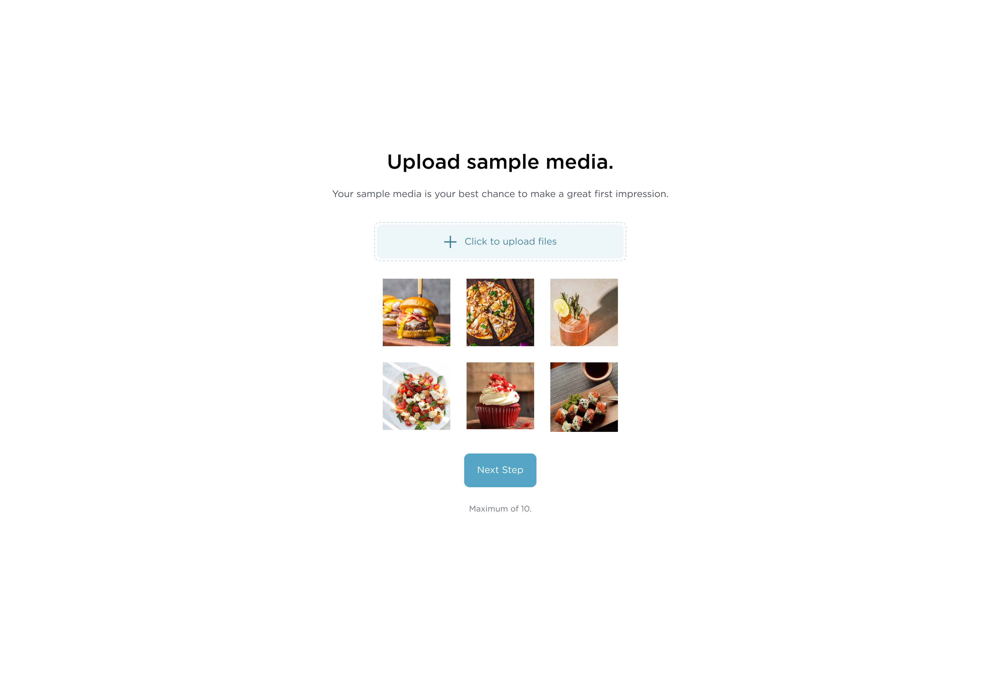
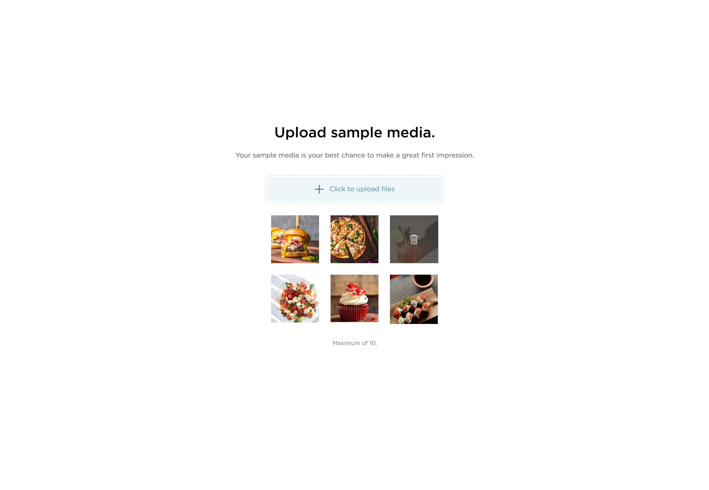

# IZEA - Frontend Software Engineer Challenge

As a Frontend Software Engineer at IZEA, it is preferable to be comfortable working within the rails framework. Hence this is a skeleton rails application, within which you are required to complete your challenge.

The sample application is only a sub feature in the world of content creation. Allowing end users to upload sample media as part of creating their online profile.

## Submission Instructions

- Create a private/public github repository for the challenge
- Create a branch to work on the challenge(s)
- Once complete open a PR and invite the following to review your code
  - [shiftedpixel](https://github.com/shiftedpixel)
  - [robinizea](https://github.com/robinizea)
  - [m-soli](https://github.com/m-soli)

Please complete at least the required Challenge to the best of your ability.

If there are any gaps in the requirements, please reach out with questions, or use your product/design decision skills to fill those gaps yourself.

## Challenges

### 1: Frontend (Required)

---




- Use the supplied Mock png's - convert the uploads index to match the new design.
  - You can find image fixtures for the gallery section inside `assets/images/fixtures`
    folder and icon svg's inside `assets/images/svgs`

### 2: Frontend/Backend (optional) - If you decide not to go through with the optional challenge, please be prepared with previous work you can walk our development team through.

- Currently the uploader uses a form submit action, however per the mocks, once a user selects a file to upload, it should upload and render in the gallery once upload is done. Think direct upload. Feel free to refactor the code and use any gems/upload frameworks.
  - Extra: Utilize Turbo Streaming to update the gallery without a full page visit.
- Hook up the delete action on the image with a backend action that destroys an `ImageUpload` record - cleaning up the storage of the associated file.
  - Extra: Utilize Turbo Streaming to update the gallery without a full page visit.

## Setup Instructions

The application runs on Rails 7, the following pre requisites should get the application running for you.

### Pre Requisites:

- Linux(Ubuntu/Debian) / MacOS - if running a windows machine please use the WSL (recommended linux distro: Ubuntu)
- Ruby version 3.2.2
- Postgressql v14 or greater
- Redis v6
- yarn

### Installing Ruby:

- We use `rbenv` at IZEA, so it is recommended to follow rbenv installation guides
- To install rbenv using [Installer](https://github.com/rbenv/rbenv-installer#rbenv-installer)

  - run in terminal: `curl -fsSL https://github.com/rbenv/rbenv-installer/raw/HEAD/bin/rbenv-installer | bash`
  - Verify installation using: `curl -fsSL https://github.com/rbenv/rbenv-installer/raw/HEAD/bin/rbenv-doctor | bash`

- To install Ruby v3.2.2:

  - run `rbenv install 3.2.2`

### Installing Postgres:

  - run `brew install postgresql@15`
- Linux

  - make sure prereq for ubuntu/debian exist: `sudo apt update && apt install -y lsb-release wget && apt clean all`

  ```bash
    # Create the file repository configuration:
    sudo sh -c 'echo "deb http://apt.postgresql.org/pub/repos/apt $(lsb_release -cs)-pgdg main" > /etc/apt/sources.list.d/pgdg.list'

    # Import the repository signing key:
    wget --quiet -O - https://www.postgresql.org/media/keys/ACCC4CF8.asc | sudo apt-key add -

    sudo apt-get update
    sudo apt-get -y install postgresql-15
  ```

- [https://www.postgresql.org/download/](https://www.postgresql.org/download/) for more information

### Installing Redis:

- [MacOS](https://redis.io/docs/getting-started/installation/install-redis-on-mac-os/)
- [Linux](https://redis.io/docs/getting-started/installation/install-redis-on-linux/)

### Installing yarn

- `npm install -g yarn`

### Running Application

- run `yarn install`
- run `./bin/setup` - should setup database locally
- run `./bin/dev` - to start processes (server, assets watching)
- navigate to your browser at `localhost:3000`
